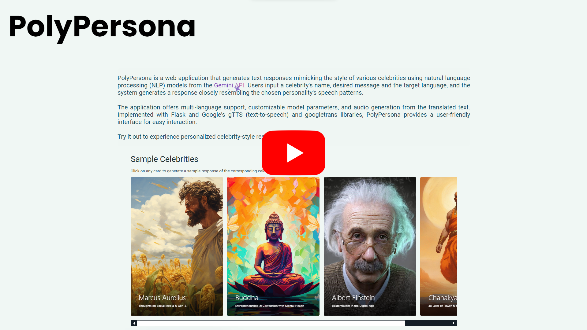

# PolyPersona

A Flask-based web app designed for generating text responses in the style of different celebrities from the past, present, or future. It utilizes natural language processing (NLP) models to mimic the speech patterns, humor, and thought processes of various public figures. Users can input the name of a celebrity, specify what they want them to say, choose a target language, and adjust model parameters to customize the response. It synergistically integrates Google's gTTS, googletrans libraries & Gemini API to provide a seamless user experience.

## [Link to the Website](https://polypersona.onrender.com/)

## Demonstration Video

[](https://youtu.be/9BzFjXA5Fcc)

## Features

- **Text Generation**: Users can input a celebrity's name and specify what they want them to say. The application generates text responses that closely resemble the style of the chosen celebrity.
- **Multi-Language Support**: The application supports translation of generated text into multiple languages, enabling users to interact with the system in their preferred language.
- **Customizable Model Parameters**: Users can adjust model parameters such as `temperature`, `top-k`, and `top-p` to control the randomness and diversity of the generated text.
- **Audio Generation**: In addition to text responses, the application generates audio files corresponding to the translated text, allowing users to hear the responses in their chosen language.
- **Real-time Translation**: After the response is generated, users can click on the "Translate" button to convert the text into a different language & produce an audio file in the translated language in real-time.
- **PDF Generation**: Users can download a PDF file containing the input details, model parameters, generated response, and translated response, enabling them to save and share the content.
- **QR Code Generation**: Generate a QR code for the website link embedded in the PDF file, allowing users to easily access the application from their mobile devices.
- **Fine-tuning**: The application allows users to fine-tune the response by making it more engaging, funny, casual, or formal, etc., depending on their preferences.
- **Sample Celebrities**: Browse through the carousel of sample celebrities to see the type of responses that can be generated by the application.
- **Web Interface**: PolyPersona provides a user-friendly web interface where users can easily input their preferences and receive generated responses.

## Tech Stack

- **Flask**: Web framework for handling HTTP requests and rendering HTML templates.
- **gTTs**: Converting text to speech, allowing the application to generate audio files corresponding to the translated text.
- **googletrans**: Translating text into different languages, enabling users to interact with the system in their preferred language.
- **Gemini API**: Generating text responses in the style of different celebrities, leveraging NLP models to mimic their speech patterns.
- **reportlab**: Generating PDF files containing the input details, model parameters and generated response, allowing users to save and share the content.
- **qrcode**: Generating QR codes for the website link embedded in the PDF file, enabling users to easily access the application from their mobile devices.
- **HTML/CSS/JavaScript**: Frontend components are implemented using HTML for structure, CSS for styling, and JavaScript for interactivity. Vanilla CSS & JS are used for simplicity, maximum compatibility & flexibility, and minimal dependencies.
- **Python**: Primary programming language used for backend development, including text generation and interaction with external APIs.
- **dotenv**: Loading environment variables from a `.env` file, providing configuration options for the application.
- **Render**: Hosting the application on Render, providing a scalable and reliable platform for running web applications.

## Installation

1. Clone the repo

   **Method 1: (Recommended)**

   - In VSCode, press `Ctrl+Shift+P`
   - Type `Git: Clone`
   - Paste the following URL: https://github.com/Hardvan/PolyPersona

   **Method 2: (Alternative)**

   Open a terminal and type the following commands:

   ```bash
   git clone https://github.com/Hardvan/FaceCounter
   cd PolyPersona
   ```

2. Create a virtual python environment by typing the following in the terminal

   ```bash
   python -m venv .venv
   ```

3. Activate the virtual environment

   Windows:

   ```bash
   .\.venv\Scripts\activate
   ```

   Linux:

   ```bash
   source .venv/bin/activate
   ```

4. Install dependencies by typing the following in the terminal

   ```bash
   pip install -r requirements.txt
   ```

5. Create a google gemini API key from [here](https://ai.google.dev/)

   Create a `.env` file in the root directory of this project and add the following line:

   ```bash
   GOOGLE_API_KEY=your_api_key
   ```

   Replace `your_api_key` with the API key you got from the google gemini website.

   Warning: Don't share your API key with anyone.

   Note: Don't enclose the API key in double or single quotes in the `.env` file.

6. Run the app

   ```bash
   python app.py
   ```

7. Click on the link in the terminal to open the website

   It will look something like this:

   ```bash
   Running on http://127.0.0.1:5000
   ```
